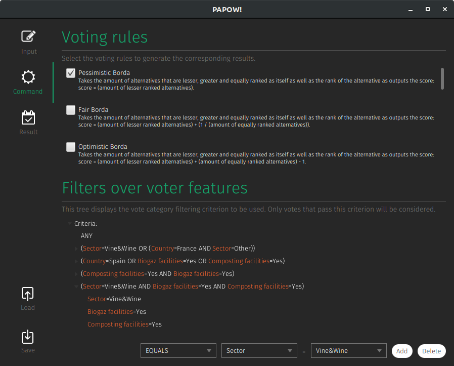
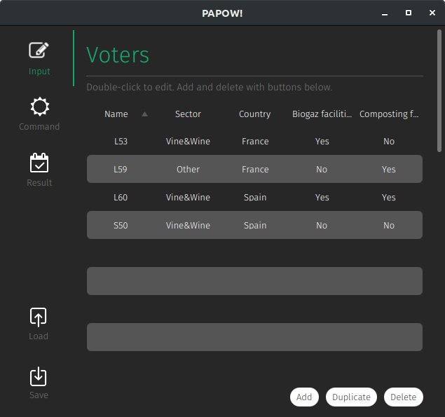
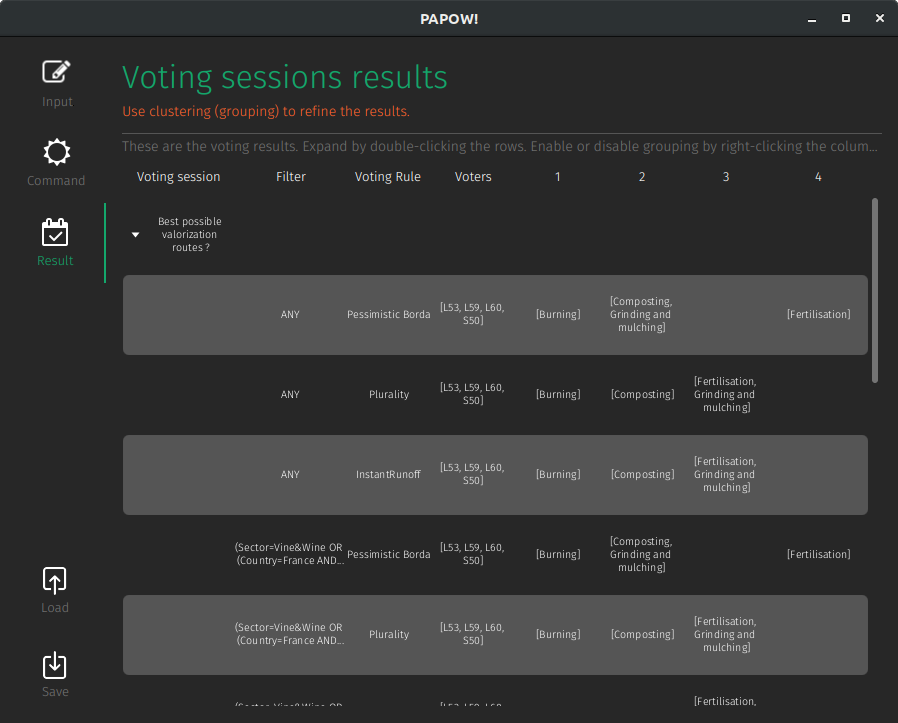

# PAPOW: Papow Aggregates Preferences and Orderings to select Winners

PAPOW APP is a voting application based on JavaFX and JFoenix for the PAPOW project that processes votes in CSV format and implements various voting algorithms.

It is also publicly available as a library [here](https://mvnrepository.com/artifact/com.github.martinjedwabny/papow).

## Pictures:

</img> 
</img> 
</img> 